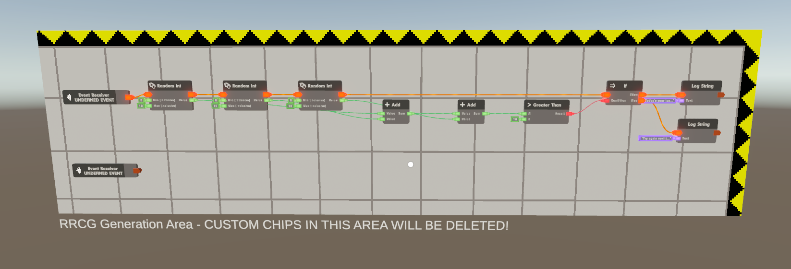
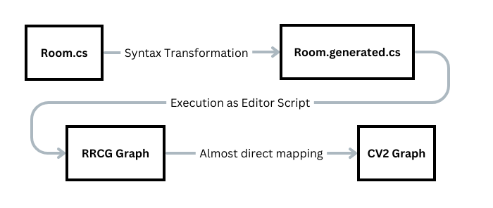

> :warning: **Consider upvoting this feature request**: https://recroom.featureupvote.com/suggestions/482338/circuits-api
> 
> We need official support for programmatic circuit manipulation to bring generated circuits into the game.
---
# RRCG - Rec Room Circuit Generator

What if you never had to move a wire by hand? What if circuits were automatically organized?



<!-- toc -->

## Install

### For development

For development: Clone the repository into the "Packages" folder of your Studio project.

e.g. as a submodule: `git submodule add https://github.com/notrabs/RRCG.git Packages/RRCG`

### via Git URL

Open `Packages/manifest.json` with your favorite text editor. Add following line to the dependencies block:
```json
{
  "dependencies": {
    "com.rrcs.RRCG": "https://github.com/notrabs/RRCG.git"
  }
}
```
---
## Using the Compiler

1. Add the `RRCG` prefab to your Scene. Place it in a location with enough space, as the chip area will grow to the top-right.
2. Open the Inspector of the RRCG prefab
3. Link/Edit a RRCG script file (*)
4. Click Compile Circuit
5. Click Build Circuit (once it is supported. Until then you can only look at the debug DOT graph)

(*) A script file needs to contain a class with the same name as the file. You can copy the already linked example class anywhere into your project.

#### DOT Graph
A DOT graph is a standard graph format that can be visualized online. You can copy a DOT into your clipboard by pressing the button in the inspector.
(e.g. [https://dreampuf.github.io/GraphvizOnline/](https://dreampuf.github.io/GraphvizOnline/))

---
## Writing Code

The goal of this language is to be an intuitive, direct mapping of C# to Circuits. With the C# execution flow being mapped to exec lines and data flow being mapped to data lines.
C# Language features should do what you expect.

Check back as more features are implemented.

### The Circuit Descriptor
The Circuit Descriptor is your entry point. Your chips start building from the `CircuitGraph()` method, but beyond that you can organize your code however you like. The only limitation for now is that the compiler only supports translating a single file at a time.
```c#
public class ExampleRoom : CircuitDescriptor
{
    public override void CircuitGraph()
    {
        // Your circuits go here
    }
}
```

### Placing Chips
Chips are available as static functions in the `Chips` class. For convenience you can access them through the extended `CircuitDescriptor` class.
```c#
public void ExampleCircuit()
{
    Chips.RandomInt(1,10);
    // or
    RandomInt(1,10);
}
```

### Data flow

Ports are data. Data is Ports. Don't worry what the type system might say. Write code as you usually would.

```c#
public void ExampleCircuit()
{
    EventReceiver(RoomEvents.Hz30);
  
    int rand1 = RandomInt(0, 10);
    var rand2 = RandomInt(0, rand1);
  
    if (rand1 + rand2 > 10) LogString("Today's your lucky day");
    else LogString("Try again next time");
}
```

### Exec flow

Functions are invisible. In most cases the execution flow follows the first pin. If a Chip has no exec input, it automatically starts a new graph.

```c#
public void ExampleCircuit()
{
    EventReceiver(RoomEvents.Hz30);
  
    var rand1 = MyFunction();
    LogString(ToString(rand1));

    EventReceiver(RoomEvents.Hz30);
    LogString("1");
}

public void MyFunction()
{
    return RandomInt(1, 2);
}
```
If and Execution Switches are fully supported. A `throw` statement ends a branch of execution if you want to model error cases. (returns are in the works)
```c#
public void ExampleCircuit()
{
    var num = Random(1,10);

    if (num == 5) {
      LogString("high five");
      throw;
    } else {
      LogString("else and else if are supported");
    }

    switch (num){
      case 1:
        LogString("1");
        break;
      case 2:
        LogString("2");
        break;
      default:
        LogString("There's gotta be a more efficient way");
        break;
    }
}
```

### Operator Overload
Math Operators and comparisons will create the according chips, and evaluate using c#'s operator order.
```c#
public void ExampleCircuit()
{
  var result = RandomInt(1,5) + 1 - 2 * 3 / 4 % 5;
   if (result > 0 && result < 0) {
      LogString("This is a scientfic breakthrough");
   }
}
```

### Existing Circuit Boards

You can generate code for existing circuit boards (or control panels). Their interface needs to be already defined in the game:

```c#
public void ExampleCircuit()
{
    // ... other circuits placed in root

    ExistingCircuitBoard("Board Name", CircuitBoard);
}

public void CircuitBoard()
{
  ExistingExecInput("AddRandom");
  var sum = ExsitingDataInput<int>("number") + RandomInt(1,10);
  ExistingDataOutput("Sum", sum);
  ExistingExecOutput("AddRandom");
}
```


### Chip Lib

The Chip Lib contains useful helpers to write common patterns. Check back as more are implemented:
```c#
public void ExampleCircuit()
{
    // The event cache creates a simple event to cache data for later execution ticks
    var expensiveSum = Add(3,4);
    var cachedSum = ChipLib.EventCache<int>(expensiveSum);
    LogString(ToString(cachedSum));
}
```

### Event Helpers
The Event helper class helps you write type-safe code. You can defined types of your ports using the c# types.
```c#
EventHelper<int> onInputEvent = new EventHelper<int>("OnInput", "value");

public void ExampleCircuit()
{
    // Place a definition chip if you want to generate an event definition
    onInputEvent.Definition();

    // Start new circuit graphs at the receiver
    var data = onInputEvent.Receiver();
    
    // Send Events using the sender
    onInputEvent.Sender(123);
}
```

Studio Events are referenced by name. There is a small helper to make this more readable, but a properly named event receiver also works:
```c#
public void StudioBoard()
{
    StudioEventReceiver("StudioEventName");
    // ... react to event
}
```
### Interfacing with Unity
You can directly call functions in other Editor scripts or libraries. They will be evaluated when you build the circuits.

:warning: Make sure the data passed to outside functions is valid c# data. If it holds a chips' port output, the function needs to support the according `Port` type. Take a look at the next chapter to learn more about the compilation process.
```c#
public void ExampleCircuit()
{
    var numOfGameObjects = GameObject.Find("Ball").Count();
    LogString("Number Of GameObjects:");
    LogString(ToString(numOfGameObjects));
}
```

---
## Custom Building Code (.generated.cs files)
The conversion of control structures (if,for,...) might not be desireable in some use-cases. Especially when you want to create a dynamic number of chips.

To implement dynamic structures you have to bypass the syntax transformation and write code directly in the build realm (= `generated` files). The syntax there is a bit more verbose, but you have the advantage of being able to use c# features to build code, instead of just describing it.



For example to generate n chips in a chain it is not possible to use a for loop: 
```c#
// This will transform into a single for chip and a single random chip
public void RRCGSourceRealm() {
  for (int i=0;i<n;i++) {
    Chips.RandomInt(0,i);
  }
} 

// In the build realm the for loop stays in the c# code. So you will generate n random chips
public void RRCGBuildRealm() {
  for (int i=0;i<n;i++) {
    ChipBuilder.RandomInt(0,i);
  }
} 
```
(Note: for loops are not implemented yet, but this example illustrates the idea)

To use the build realm simply write your code in a non-compiled file. 
More documnentation to come, but looking at the ChipLib source would be a good place to start. Note how there's two version of it so it can be used in the `RRCGSource` and `RRCGBuild` namespace with different types.


---
## Roadmap
Things to do that are in scope of the RRCG project. Although contributions are welcome, even if not listed here.
- [ ] Circuit Building Backend (with an official API)
- [ ] Support more CV2 features
  - [ ] Circuit Boards
  - [ ] Variable Kinds
  - [ ] Event Kinds
  - [ ] ... (basically anything that can be configured)
- [ ] Support more C# language features
  - [ ] returns (for execs and values)
  - [ ] value switches
  - [ ] conditional values
  - [ ] (automatic) type casts
- [ ] Compiler improvements
  - [ ] Can the workflow be made faster? ([Source Generators](https://learn.microsoft.com/en-us/dotnet/csharp/roslyn-sdk/source-generators-overview) would be nice)
  - [ ] Support more than one file for compilation (automatic dependencies?)
  - [ ] Attribute to disable syntax transformation of c# code
- [ ] Circuit Formatter improvements
  - [ ] Improve chip size estimation 
  - [ ] Allow formatting a selection of circuits (with an official API)
- [ ] Decompilation (Circuits to Code)
  - [ ] This wouldn't be perfect, but could be nice to build a library
- [ ] Optimization ideas
  - [ ] Collapse math operations (e.g. multipler adds into a single chip)
  - [ ] Automatically replace multiple "Equal-Ifs" with switches (also in combination with returns)
- [ ] Online playground
  - [ ] Would be great for documentation 

---
## Useful Resources
* [Roslyn Quoter](https://roslynquoter.azurewebsites.net/)
* [DOT Graph Visualizer](https://dreampuf.github.io/GraphvizOnline/)
